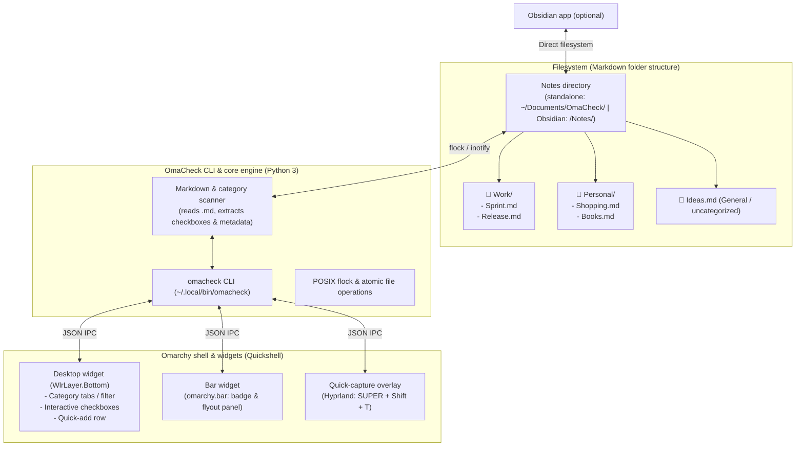

# OmaCheck — Specification & Implementation Plan
**Universal notes & to-do app with optional categories, interactive checkboxes, desktop widget & optional Obsidian support for Omarchy Linux**

> Note: this is the original planning document. Some details below (CLI subcommands, file names, config keys) describe the initial plan and have since evolved during implementation — see README.md for the shipped feature set and CLI.

---

## 1. Overview & product vision

**OmaCheck** (`omacheck`) is a universal, minimalist notes and task app for Omarchy Linux (Arch Linux + Hyprland + Quickshell).

It combines free-form Markdown notes with **interactive to-do checklists as a must-have core feature**. Instead of rigid daily notes, OmaCheck manages independent, topical notes with optional categorization.

Following the **Ponytail principle** (*lazy senior dev: "The best code is the code never written"*):
- **No proprietary database, no sync daemon:** plain Markdown (`.md`) is the single source of truth.
- **Seamless Obsidian integration:** a notes folder inside an Obsidian vault is directly the data store. Every note exists 1:1 in Obsidian.
- **Native desktop widget:** a quick overview and one-click checking off, directly on the desktop (Quickshell layer-shell).
- **Zero idle overhead:** uses the existing `omarchy-shell` runtime and POSIX filesystem primitives.

---

## 2. Core requirements & features

| Requirement | Status | Specification |
| :--- | :--- | :--- |
| **Universal notes** | **Implemented** | Free-form notes with Markdown support (no daily-notes requirement). |
| **Interactive checkboxes** | **Implemented** | `- [ ]` and `- [x]`, checked/reopened by clicking in the desktop widget, the bar, and the app. |
| **Optional categories** | **Implemented** | Notes can be assigned categories (subfolder or frontmatter), plus pinned categories that don't need a note yet. |
| **Desktop widget** | **Implemented** | Permanent Quickshell service widget (`WlrLayer.Bottom`) on the wallpaper; can be turned off from Settings. |
| **Native Omarchy app** | **Implemented** | Standalone application window (`omacheck gui` / `omacheck.desktop`) with native theme integration (`qs.Commons.Color`, `qs.Ui.Style`). |
| **Obsidian support** | **Implemented** | Optional, chosen in Settings; automatic vault detection via `~/.config/obsidian/obsidian.json` when enabled. |
| **Linux / Omarchy native** | **Implemented** | CLI, desktop launcher, Quickshell theme bindings, bar integration. |

---

## 3. Architecture & data organization



### 3.1 Categorization model (hybrid & flexible)
Categories are supported in two naturally overlapping ways:
1. **Folder-based (default for Obsidian):**
   - Each subcategory is a subfolder: `<Vault>/Notes/<Category>/<Note>.md`.
   - Notes directly in the root folder (`<Vault>/Notes/<Note>.md`) count as *uncategorized* / *General*.
2. **Metadata-based (YAML frontmatter / tags):**
   - If a note is stored flat, it can be categorized via YAML frontmatter:
     ```markdown
     ---
     category: Work
     tags: [project-a, sprint]
     ---
     # Sprint Backlog
     - [ ] Write documentation
     ```
3. **Pinned categories:** a category name can also be pinned in config without any note yet, so it shows up in the category list (and can be added via the "+" button in the widget/app) before the first note is filed under it.
4. **Result:** OmaCheck scans both folders and frontmatter. The user doesn't have to think about it — it "just works" whether the notes live in Obsidian or a plain folder.

---

## 4. Data format: notes & to-dos

Every note is a standard-compliant Markdown file.

### Example: `Notes/Work/Sprint-Planning.md`
```markdown
---
category: Work
pinned: true
---
# Sprint Planning Q4

Important notes for the architecture review before the next milestone.

## Tasks
- [ ] Finalize the OmaCheck spec #desktop ⏫ 📅 2026-09-15
- [ ] Implement the Quickshell desktop widget #ui 🔼
- [x] Verify Obsidian vault detection ✅ 2026-09-12

## Free-form notes
- Define Hyprland window rules for floating capture
- Test Quickshell theme hooks
```

### Parsing rules:
- **Checkboxes (`- [ ]`, `- [x]`):** indexed by OmaCheck and given a unique ID per file (`file:line`, or numbered for the UI).
- **Free text & headings:** shown in the detail view / note viewer.
- **Obsidian Tasks emoji:** optional due dates (`📅`), priorities (`⏫`, `🔼`, `🔽`), and completion dates (`✅`) are preserved and rendered as badges in the UI.

---

## 5. UI & desktop widget specification

The desktop widget is implemented as a Quickshell plugin (`carsten.omacheck`) for Omarchy's built-in `omarchy-shell`.

### 5.1 Desktop widget (`DesktopWidgetView.qml`)
- **Layer & behavior:**
  - `WlrLayershell.layer: WlrLayer.Bottom` (on the desktop background, doesn't interfere with tiling windows).
  - Can be turned off entirely from the app's Settings panel.
- **Layout:**
  ```
  +-------------------------------------------------------------+
  |  OmaCheck                                     [+] New note  |
  |  [ All ] [ Work (4) ] [ Personal (2) ] [ Ideas (1) ] [+]     |
  +-------------------------------------------------------------+
  |  ▼ Sprint-Planning.md (Work)                                 |
  |    [ ] Finalize the OmaCheck spec             [⏫] [Sep 15]  |
  |    [ ] Implement the Quickshell desktop widget [🔼]          |
  |    [x] Verify Obsidian vault detection        [✅ Sep 12]    |
  |                                                             |
  |  ▶ Shopping-List.md (Personal)                               |
  |    2 open checkboxes ...                                    |
  +-------------------------------------------------------------+
  |  + Enter a new task for 'Work'... [Enter]                   |
  +-------------------------------------------------------------+
  ```
- **Interactive checking off:** clicking a checkbox runs `omacheck toggle <task_id>` in the background. The checkbox toggles without flicker, and the Markdown file is updated atomically.
- **Category tabs:** switching tabs filters the visible tasks and notes; the "+" pins a new category.
- **Theming:** colors (`qs.Commons.Color`) and typography follow the active Omarchy theme seamlessly.

### 5.2 Bar widget (`BarWidget.qml`)
- Shows a checklist icon with a counter (e.g. `4` for 4 open tasks).
- **Left click:** opens the OmaCheck app directly.
- **Right click:** refreshes the counter.

### 5.3 Quick-capture overlay (planned)
- Shortcut: `SUPER + Shift + T`.
- A centered dialog for quickly capturing a new note or a new checkbox task, including a category dropdown. Not yet implemented — see README.md for the current CLI/app-based quick-add flows.

---

## 6. CLI interface (`omacheck`)

The CLI tool drives all operations and feeds data to the Quickshell widgets. See README.md for the exact, currently shipped set of commands and flags; the original plan sketched:

```bash
# === Notes & categories ===
omacheck categories                    # Lists all categories with a task counter
omacheck notes [--category <name>]     # Lists all notes (optionally filtered by category)
omacheck note create "Title" [--category <name>]  # Creates a new note
omacheck note view "Title"             # Shows a note in the terminal
omacheck note edit "Title"             # Opens a note in $EDITOR

# === Tasks & checkboxes ===
omacheck tasks [--category <name>] [--json] # Outputs all checkboxes, structured
omacheck add "Task" [--category <name>] [--note "Note name"] [--priority high]
omacheck toggle <task-id>              # Toggles a checkbox (- [ ] <-> - [x])
omacheck delete <task-id>              # Removes a task

# === Obsidian & status ===
omacheck status                        # Shows the active storage mode, notes path, and location
omacheck open-obsidian [note name]     # Opens a note or the vault directly in Obsidian
```

### JSON schema for widgets (`omacheck tasks --json`):
```json
{
  "categories": ["All", "Work", "Personal", "Ideas"],
  "selected_category": "Work",
  "notes_count": 5,
  "tasks_total": 8,
  "tasks_open": 3,
  "notes": [
    {
      "title": "Sprint-Planning",
      "category": "Work",
      "path": "/home/carsten/Documents/OmaCheck/Work/Sprint-Planning.md",
      "tasks": [
        {
          "id": "sprint:8",
          "text": "Finalize the OmaCheck spec",
          "completed": false,
          "priority": "high",
          "due_date": "2026-09-15",
          "tags": ["desktop"],
          "line": 8
        },
        {
          "id": "sprint:10",
          "text": "Verify Obsidian vault detection",
          "completed": true,
          "line": 10
        }
      ]
    }
  ]
}
```

---

## 7. Configuration (`~/.config/omacheck/config.json`)

```json
{
  "storage": {
    "mode": "standalone",
    "obsidian_vault": "auto",
    "notes_dir_name": "Notes",
    "fallback_dir": "~/Documents/OmaCheck"
  },
  "categories": {
    "default_category": "General",
    "pinned": ["Work", "Personal", "Ideas"]
  },
  "tasks": {
    "append_completion_date": true,
    "hide_completed_after_days": 3
  },
  "widgets": {
    "bar_enabled": false,
    "desktop_enabled": true
  }
}
```

---

## 8. Project file structure

```
/home/carsten/Projects/omacheck/
├── SPEC.md                    # This specification
├── README.md                  # Quickstart & documentation
├── omacheck.py                # Core engine & CLI (Python 3 stdlib)
├── install.py                 # Install script (CLI + plugin + Hyprland)
├── tests/
│   ├── test_omacheck.py       # Unit tests for the core engine
│   └── check_ui.py            # Quickshell/QtTest smoke check for the desktop widget
└── plugin/                    # Quickshell plugin (carsten.omacheck)
    ├── manifest.json          # Plugin metadata for omarchy-shell (kinds: service, bar-widget, panel)
    ├── Service.qml            # Desktop-widget host (layer-shell window)
    ├── DesktopWidgetView.qml  # Universal desktop widget with categories & checkboxes
    ├── BarWidget.qml          # Bar icon with counter; opens the app via shell IPC
    └── AppPanel.qml           # Native app window, loaded in-process as a `panel` plugin
```

The app window (`AppPanel.qml`) is a `panel`-kind entry point of this same
plugin, loaded in-process by the running `omarchy-shell` the same way
`omarchy.menu` loads its own panel — not a separate `quickshell -p` process.
`omacheck gui` / `omacheck app` and the bar widget's click handler both just
run `omarchy-shell shell toggle carsten.omacheck`, matching the framework's
own convention ("summoning a panel is an IPC call into a process that is
already running, not a fresh cold start").

---

## 9. Implementation steps

1. **Phase 1: Notes & checkbox engine (`omacheck.py`)**
   - Folder- and frontmatter-based scanner for notes and optional categories.
   - Precise parser for GFM checkboxes (`- [ ]`, `- [x]`) with line-number tracking.
   - Atomic toggle function using POSIX `flock` and `os.replace`.
   - Vault detection via `~/.config/obsidian/obsidian.json`.

2. **Phase 2: Quickshell desktop widget (`DesktopWidgetView.qml`)**
   - Desktop layer (`WlrLayershell.layer: WlrLayer.Bottom`) with a theme-matched background.
   - Category bar (tabs / pills) for switching, plus pinning new categories.
   - List of notes and checkbox items with click interaction via `omacheck toggle`.
   - Quick-add row for new checkbox tasks directly in the active note/category.

3. **Phase 3: Bar widget (`BarWidget.qml`)**
   - Counter display in the bar (`omarchy.bar`), toggleable from Settings.

4. **Phase 4: Hyprland bindings & installer**
   - `install.py` for safe linking into `~/.local/bin/` and `~/.config/omarchy/plugins/carsten.omacheck/`.
   - Quick-capture shortcut (`SUPER + Shift + T`) remains a future enhancement.
