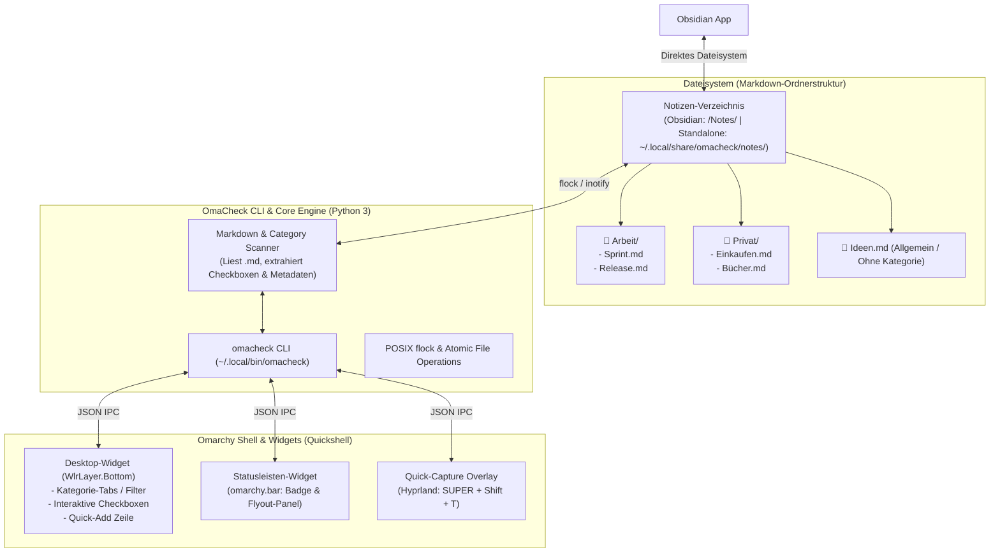

# OmaCheck — Spezifikation & Implementierungsplan
**Universelle Notizen- & To-Do-App mit optionalen Kategorien, interaktiven Checkboxen, Desktop-Widget & Obsidian-Support für Omarchy Linux**

---

## 1. Übersicht & Produktvision

**OmaCheck** (`omacheck`) ist eine universelle, minimalistische Notizen- und Aufgaben-App für Omarchy Linux (Arch Linux + Hyprland + Quickshell). 

Sie kombiniert freie Markdown-Notizen mit **interaktiven To-Do-Checklisten als Must-Have Kernfeature**. Statt starrer Tagesnotizen (Daily Notes) verwaltet OmaCheck eigenständige, thematische Notizen mit optionaler Kategorisierung.

Gemäß dem **Ponytail-Prinzip** (*Lazy Senior Dev: "The best code is the code never written"*):
- **Keine proprietäre Datenbank, kein Sync-Daemon:** Reines Markdown (`.md`) ist die Single Source of Truth.
- **Nahtlose Obsidian-Integration:** Ein Notizen-Ordner im Obsidian-Vault ist direkt die Datenbasis. Jede Notiz existiert 1:1 in Obsidian.
- **Natives Desktop-Widget:** Schneller Überblick und direktes Abhaken von Checkboxen direkt auf dem Desktop (Quickshell Layer-Shell).
- **Zero Idle Overhead:** Nutzt die existierende `omarchy-shell` Laufzeitumgebung und POSIX Dateisystem-Primitives.

---

## 2. Kernanforderungen & Features

| Anforderung | Status | Spezifikation |
| :--- | :--- | :--- |
| **Universelle Notizen** | **Implementiert** | Freie Notizen mit Markdown-Unterstützung (kein Zwang zu Daily Notes). |
| **Interaktive Checkboxen** | **Implementiert** | `- [ ]` und `- [x]` direkt im Desktop-Widget, in der Bar und in der App per Klick abhaken/wiedereröffnen. |
| **Optionale Kategorien** | **Implementiert** | Notizen können Kategorien zugeordnet werden (Unterordner oder Frontmatter). |
| **Desktop-Widget** | **Implementiert** | Permanentes Quickshell-Service-Widget (`WlrLayer.Bottom`) auf dem Wallpaper. |
| **Native Omarchy App** | **Implementiert** | Eigenständiges Anwendungsfenster (`omacheck gui` / `omacheck.desktop`) mit nativer Theme-Anbindung (`qs.Commons.Color`, `qs.Ui.Style`). |
| **Obsidian-Support** | **Implementiert** | Automatische Vault-Erkennung via `~/.config/obsidian/obsidian.json` mit Standalone-Fallback. |
| **Linux / Omarchy-Nativ** | **Implementiert** | CLI, Desktop-Launcher, Quickshell Theme-Bindings, Bar-Integration. |

---

## 3. Architektur & Datenorganisation



### 3.1 Kategorisierungsmodell (Hybrid & Flexibel)
Kategorien werden auf zwei natürlich ineinandergreifende Weisen unterstützt:
1. **Ordnerbasiert (Standard für Obsidian):**
   - Jede Unterkategorie ist ein Unterordner: `<Vault>/Notes/<Kategorie>/<Notiz>.md`.
   - Notizen direkt im Hauptordner (`<Vault>/Notes/<Notiz>.md`) gelten als *uncategorized* / *Allgemein*.
2. **Metadatenbasiert (YAML Frontmatter / Tags):**
   - Falls eine Notiz flach abgelegt ist, kann sie per YAML Frontmatter kategorisiert werden:
     ```markdown
     ---
     category: Arbeit
     tags: [projekt-a, sprint]
     ---
     # Sprint Backlog
     - [ ] Dokumentation schreiben
     ```
3. **Ergebnis:** OmaCheck scannt sowohl Ordner als auch Frontmatter. Der Benutzer muss sich um nichts kümmern – es "funktioniert einfach" sowohl in Obsidian als auch im Dateimanager.

---

## 4. Datenformat: Notizen & To-Dos

Jede Notiz ist eine standardkonforme Markdown-Datei. 

### Beispiel: `Notes/Arbeit/Sprint-Planung.md`
```markdown
---
category: Arbeit
pinned: true
---
# Sprint-Planung Q4

Wichtige Notizen zum Architektur-Review vor dem nächsten Meilenstein.

## Aufgaben
- [ ] Spec für OmaCheck finalisieren #desktop ⏫ 📅 2026-09-15
- [ ] Quickshell DesktopWidget implementieren #ui 🔼
- [x] Obsidian Vault Erkennung prüfen ✅ 2026-09-12

## Freitext / Notizen
- Hyprland Window-Rules für Floating Capture definieren
- Quickshell theme hooks testen
```

### Parsing-Regeln:
- **Checkboxen (`- [ ]`, `- [x]`):** Werden von OmaCheck indiziert und erhalten eine eindeutige ID pro Datei (`datei:zeile` bzw. nummeriert für die UI).
- **Freitext & Überschriften:** Werden im Detail-View / Notiz-Viewer angezeigt.
- **Obsidian Tasks Emojis:** Optionale Fälligkeiten (`📅`), Prioritäten (`⏫`, `🔼`, `🔽`) und Abschlussdaten (`✅`) bleiben erhalten und werden in der UI als Badges gerendert.

---

## 5. UI & Desktop-Widget Spezifikation

Das Desktop-Widget wird als Quickshell-Plugin (`carsten.omacheck`) für die in Omarchy integrierte `omarchy-shell` umgesetzt.

### 5.1 Desktop-Widget (`DesktopWidget.qml`)
- **Layer & Verhalten:**
  - `WlrLayershell.layer: WlrLayer.Bottom` (auf dem Desktop-Hintergrund, stört kachelnde Fenster nicht).
  - Wahlweise mit `SUPER + Shift + D` in den Vordergrund togglebar.
- **Aufbau:**
  ```
  +-------------------------------------------------------------+
  |  OmaCheck                                     [+] Neue Notiz|
  |  [ Alle ] [ Arbeit (4) ] [ Privat (2) ] [ Ideen (1) ]       |
  +-------------------------------------------------------------+
  |  ▼ Sprint-Planung.md (Arbeit)                               |
  |    [ ] Spec für OmaCheck finalisieren         [⏫] [15. Sep]|
  |    [ ] Quickshell DesktopWidget implementieren [🔼]          |
  |    [x] Obsidian Vault Erkennung prüfen        [✅ 12. Sep]  |
  |                                                             |
  |  ▶ Einkaufsliste.md (Privat)                                |
  |    2 offene Checkboxen ...                                  |
  +-------------------------------------------------------------+
  |  + Neue Aufgabe für 'Arbeit' eingeben... [Enter]            |
  +-------------------------------------------------------------+
  ```
- **Interaktives Abhaken:** Ein Klick auf die Checkbox führt im Hintergrund `omacheck toggle --file "<path>" --line <nr>` aus. Die Checkbox toggelt ohne Flackern, die Markdown-Datei wird atomar aktualisiert.
- **Kategorie-Tabs:** Schnelles Umschalten filtert die sichtbaren Aufgaben und Notizen.
- **Theming:** Farben (`qs.Commons.Color`) und Typografie passen sich nahtlos an das aktive Omarchy-Theme an.

### 5.2 Statusleisten-Widget (`BarWidget.qml`)
- Zeigt ein Notiz-/Häkchen-Icon mit Zähler (z. B. `4` für 4 offene Aufgaben in der aktiven Kategorie).
- **Linksklick:** Öffnet ein schwebendes Panel (`Panel.qml`) mit den wichtigsten Aufgaben und Notizen.
- **Rechtsklick:** Schneller Kategoriewechsel über ein Kontextmenü.

### 5.3 Quick-Capture Overlay
- Tastenkombination: `SUPER + Shift + T`.
- Zentrierter Dialog zum schnellen Erfassen einer neuen Notiz oder einer neuen Checkbox-Aufgabe inkl. Kategorie-Dropdown.

---

## 6. CLI-Schnittstelle (`omacheck`)

Das CLI-Tool steuert alle Operationen und liefert Daten für die Quickshell-Widgets:

```bash
# === Notizen & Kategorien ===
omacheck categories                    # Listet alle Kategorien mit Aufgaben-Zähler auf
omacheck notes [--category <name>]     # Listet alle Notizen (optional nach Kategorie gefiltert)
omacheck note create "Titel" [--category <name>]  # Erstellt eine neue Notiz
omacheck note view "Titel"             # Zeigt eine Notiz im Terminal
omacheck note edit "Titel"             # Öffnet Notiz in $EDITOR

# === Aufgaben & Checkboxen ===
omacheck tasks [--category <name>] [--json] # Gibt alle Checkboxen strukturiert aus
omacheck add "Aufgabe" [--category <name>] [--note "Notizname"] [--priority high]
omacheck toggle <task-id>              # Hakt Checkbox ab (- [ ] <-> - [x])
omacheck delete <task-id>              # Entfernt Aufgabe

# === Obsidian & Status ===
omacheck status                        # Zeigt aktiven Vault, Notizenpfad und Speicherort
omacheck open-obsidian [Notizname]     # Öffnet Notiz oder Vault direkt in Obsidian
```

### JSON-Schema für Widgets (`omacheck tasks --json`):
```json
{
  "categories": ["Alle", "Arbeit", "Privat", "Ideen"],
  "selected_category": "Arbeit",
  "notes_count": 5,
  "tasks_total": 8,
  "tasks_open": 3,
  "notes": [
    {
      "title": "Sprint-Planung",
      "category": "Arbeit",
      "path": "/home/carsten/Nextcloud/Obsidian/Myvault/CarstensVault/Notes/Arbeit/Sprint-Planung.md",
      "tasks": [
        {
          "id": "sprint:8",
          "text": "Spec für OmaCheck finalisieren",
          "completed": false,
          "priority": "high",
          "due_date": "2026-09-15",
          "tags": ["desktop"],
          "line": 8
        },
        {
          "id": "sprint:10",
          "text": "Obsidian Vault Erkennung prüfen",
          "completed": true,
          "line": 10
        }
      ]
    }
  ]
}
```

---

## 7. Konfiguration (`~/.config/omacheck/config.json`)

```json
{
  "storage": {
    "mode": "obsidian",
    "obsidian_vault": "auto",
    "notes_dir_name": "Notes",
    "fallback_dir": "~/.local/share/omacheck/notes"
  },
  "categories": {
    "default_category": "Allgemein",
    "pinned": ["Arbeit", "Privat", "Ideen"]
  },
  "tasks": {
    "append_completion_date": true,
    "hide_completed_after_days": 3
  },
  "widget": {
    "position": "top-right",
    "width": 380,
    "max_height": 520,
    "opacity": 0.88,
    "layer": "bottom"
  }
}
```

---

## 8. Dateistruktur des Projekts

```
/home/carsten/Projects/omacheck/
├── SPEC.md                    # Diese Spezifikation
├── README.md                  # Quickstart & Dokumentation
├── omacheck.py                # Core Engine & CLI (Python 3 stdlib)
├── install.py                 # Installationsskript (CLI + Plugin + Hyprland)
├── tests/
│   ├── test_notes_scanner.py  # Tests für Kategorien- & Notizen-Erkennung
│   ├── test_checkbox_toggle.py# Tests für atomare Checkbox-Änderungen
│   └── test_locking.py        # Parallele Zugriffe & Concurrency
└── plugin/                    # Quickshell Plugin (carsten.omacheck)
    ├── manifest.json          # Plugin-Metadaten für omarchy-shell
    ├── DesktopWidget.qml      # Universelles Desktop-Widget mit Kategorien & Checkboxen
    ├── BarWidget.qml          # Statusleisten-Icon mit Zähler
    ├── Panel.qml              # Flyout-Panel für die Statusleiste
    └── QuickCapture.qml       # Notiz- / Aufgaben-Schnelleingabe
```

---

## 9. Implementierungs-Schritte

1. **Phase 1: Notizen- und Checkbox-Engine (`omacheck.py`)**
   - Ordner- und Frontmatter-Scanner für Notizen und optionale Kategorien.
   - Präziser Parser für GFM-Checkboxen (`- [ ]`, `- [x]`) mit Zeilennummern-Tracking.
   - Atomare Toggle-Funktion mit POSIX `flock` und `os.replace`.
   - Vault-Erkennung über `~/.config/obsidian/obsidian.json`.

2. **Phase 2: Quickshell Desktop-Widget (`DesktopWidget.qml`)**
   - Desktop-Layer (`WlrLayershell.layer: WlrLayer.Bottom`) mit Theme-Hintergrund.
   - Kategorie-Leiste (Tabs / Pillen) zum Umschalten.
   - Liste der Notizen und Checkbox-Items mit Klick-Interaktion via `omacheck toggle`.
   - Schnelleingabezeile für neue Checkbox-Aufgaben direkt in die aktive Notiz/Kategorie.

3. **Phase 3: Bar-Widget & Panel (`BarWidget.qml`, `Panel.qml`)**
   - Zähler-Anzeige in der Bar (`omarchy.bar`).
   - Schwebendes Panel mit kompakter Aufgabenansicht.

4. **Phase 4: Hyprland-Bindings & Installer**
   - Shortcut `SUPER + Shift + T` für Quick-Capture registrieren.
   - `install.py` zur schadlosen Verlinkung nach `~/.local/bin/` und `~/.config/omarchy/plugins/carsten.omacheck/`.
